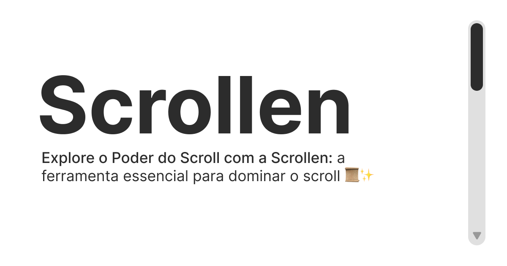

<p align="center">

</p>

# Scrollen

A performant utility scroll hook for React.

## Install

```sh
npm install scrollen
```

## Getting Started

To start using the scrollen you need import and call the `useScroller` hook

```js
import { useScroller } from 'scrollen'

const scroller = useScroller()
```

then you need to set the scroller element

```jsx
import { useScroller } from 'scrollen'

const scroller = useScroller()

<div ref={scroller.setScrollerElement}>
  ...
</div>
```

And that's it! Now you can start playing with your scroller.

### Example

See this [small example](https://github.com/joaom00/scrollen/blob/main/website/src/app/page.tsx) of how you can use the hook.

## Documentation

First of all, a huge thanks to [@diegohaz](https://twitter.com/diegohaz) as this library uses the
Ariakit Component Stores API, so refer to the Ariakit [Component Stores Guide](https://ariakit.org/guide/component-stores) to learn the core
of the hook.

### Props

| Prop                | Description                                                    |
| ------------------- | -------------------------------------------------------------- |
| `initialScrollTop`  | The initial `scrollTop` value to the scroller element.         |
| `initialScrollLeft` | The initial `scrollLeft` value to the scroller element.        |
| `startScrollAt`     | Where the scroll should start. You can pass `bottom \| right`. |

### State

| State              | Description                                                         |
| ------------------ | ------------------------------------------------------------------- |
| `element`          | The scroller element.                                               |
| `scrollTop`        | The `scrollTop` value for the scroller element.                     |
| `scrollLeft`       | The `scrollLeft` value for the scroller element.                    |
| `scrollWidth`      | The `scrollWidth` value for the scroller element.                   |
| `scrollHeight`     | The `scrollHeight` value for the scroller element.                  |
| `scrollY`          | The progress of the vertical scroll. (between 0 and 1)              |
| `scrollX`          | The progress of the horizontal scroll. (between 0 and 1)            |
| `scrollLengthY`    | The length of the vertical scroll.                                  |
| `scrollLengthX`    | The length of the horizontal scroll.                                |
| `velocityY`        | The velocity of the vertical scroll.                                |
| `velocityX`        | The velocty of the horizontal scroll.                               |
| `scrollDirectionY` | The direction of the vertical scroll. (`static \| up \| down`)      |
| `scrollDirectionX` | The direction of the horizontal scroll. (`static \| left \| right`) |
| `isScrollingY`     | A boolean to check if the vertical scroll is scrolling.             |
| `isScrollingX`     | A boolean to check if the horizontal scroll is scrolling.           |
| `isAtTop`          | A boolean to check if the scroll reached the top.                   |
| `isAtBottom`       | A boolean to check if the scroll reached the bottom.                |
| `isAtLeft`         | A boolean to check if the scroll reached the left.                  |
| `isAtRight`        | A boolean to check if the scroll reached the right.                 |

### Functions

| Function             | Description                                                                             |
| -------------------- | --------------------------------------------------------------------------------------- |
| `setScrollerElement` | Function to set the scroller element.                                                   |
| `scrollToTop`        | Function to scroll programatically to top.                                              |
| `scrollToLeft`       | Function to scroll programatically to left.                                             |
| `scrollToBottom`     | Function to scroll programatically to bottom.                                           |
| `scrollToRight`      | Function to scroll programtically to right.                                             |
| `useOnScrollTop`     | A custom hook to register a callback that is called when the scroll reached the top.    |
| `useOnScrollBottom`  | A custom hook to register a callback that is called when the scroll reached the bottom. |

## Acknowledgements

- Ariakit - Thanks to [@diegohaz](https://twitter.com/diegohaz) for the Component Stores API that
  made it possible to create a performant hook.
- react-virtuoso - Where did I get ideas for utilities.
